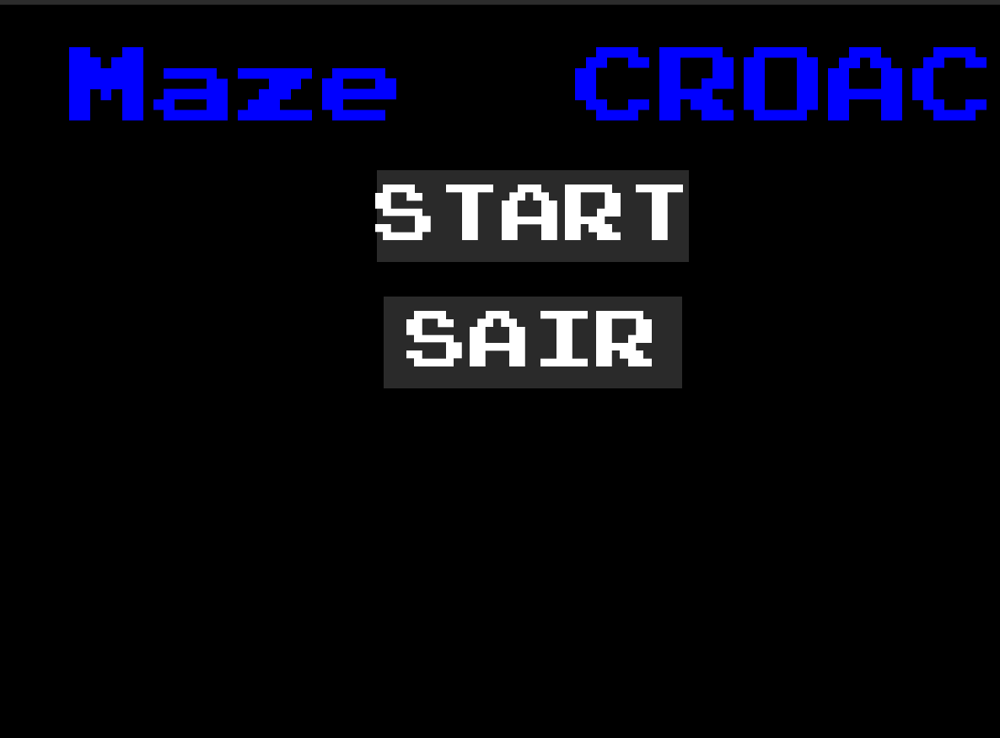
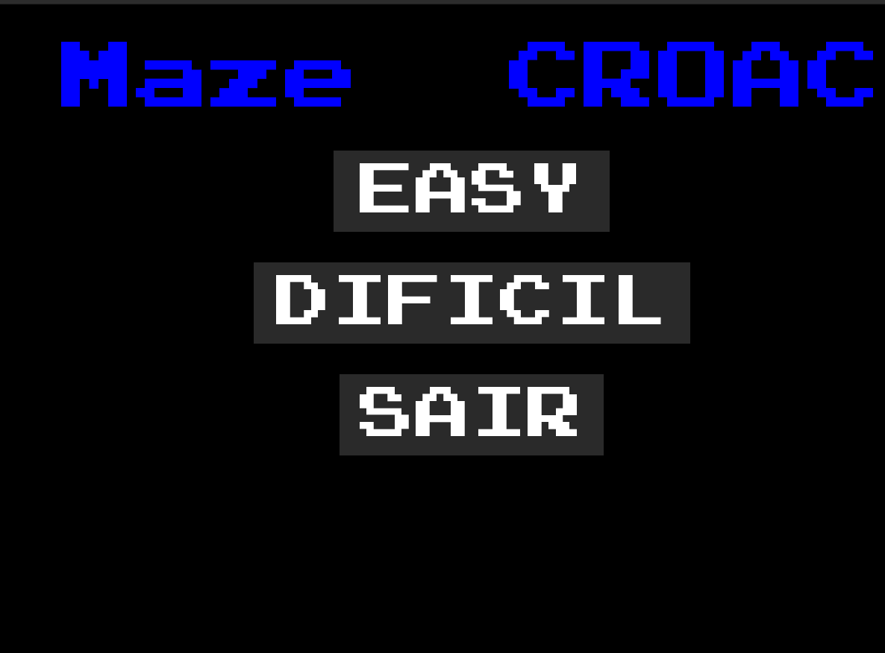
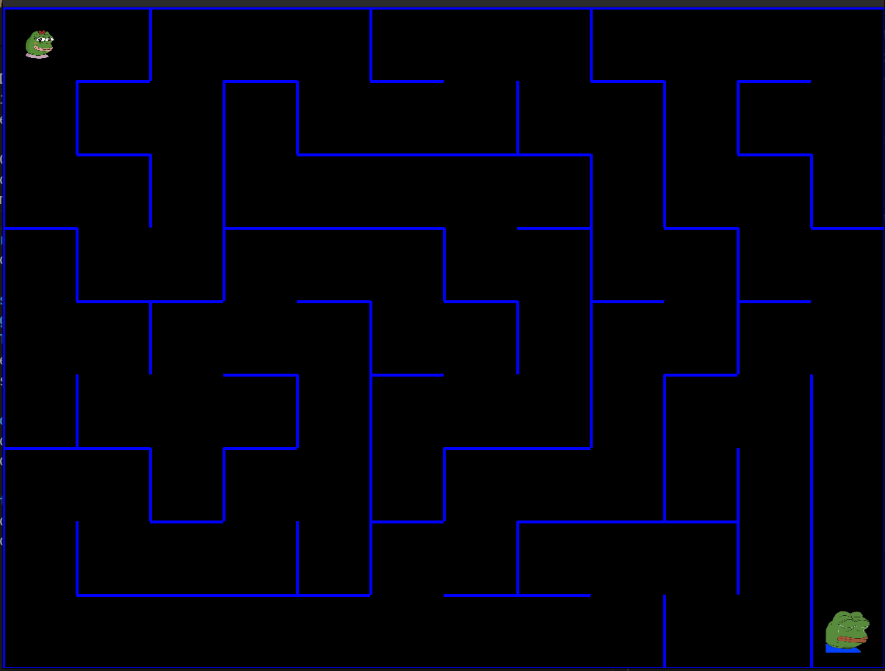

# Grafos1_MazeRun
Temas:
 - Grafos1
 
# MazeRun

**Trabalho**: Grafos 1<br>
**Conteúdo da Disciplina**: Grafos 1<br>

## Alunos
|Matrícula | Aluno |
| -- | -- |
| 18/0024868  |  Mateus Moreira Lima |
| 19/0044390  |  Victor Rayan Adriano Ferreira  |

## Sobre 
Nosso trabalho consiste em um labirinto gerado randomicamente por uma DFS (Depth First Search). Para cada posição de célula visitada pelo algoritmo de DFS ele retira 2 paredes aleatórias, gerando um caminho diferente para cada nova rodada.

Maze Croac é um jogo que consiste em Pepa, uma sapinha feliz que tem desejo de ajudar Pepe, um sapinho triste, para isso ela tem que passar por um labirinto mortal, onde todas as paredes são feitas de sal.

## Screenshots
Tela inicial do jogo:

Tela de seleção de dificuldade:

Tela de gameplay do jogo:


## Instalação 
**Linguagem**: Python<br>
**Biblioteca**: Pygame<br>

Para rodar o jogo é necessário ter python instalado na máquina.

Rode o comando a seguir para baixar o pygame:
```
    $ pip install pygame

ou

    $ pip3 install pygame
```

Para rodar a aplicação certifique se estar dentro da pasta MazeRun:

```
# Para entrar dentro da pasta MazeRun:

    $ cd MazeRun

# Rodar a aplicação:

    $ python controlergamer.py

ou

    $ python3 controlergamer.py
```


## Uso

1. Selecione o botão de início de jogo.
2. Selecione a dificuldade.
3. Utilize as teclas W, A, S, D para se movimentar pela tela.
